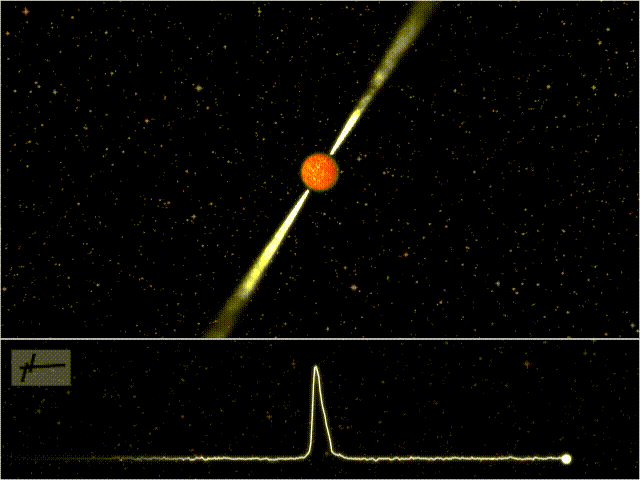
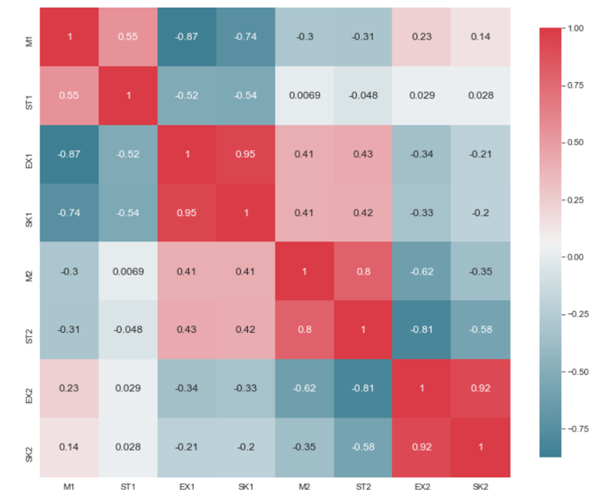
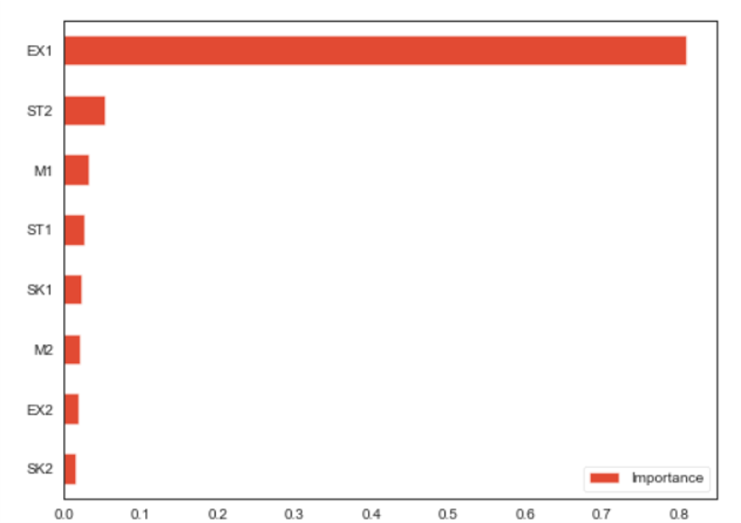
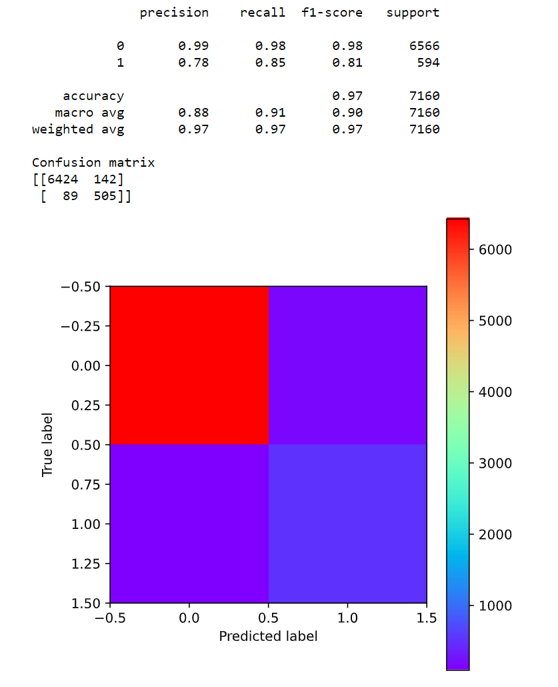
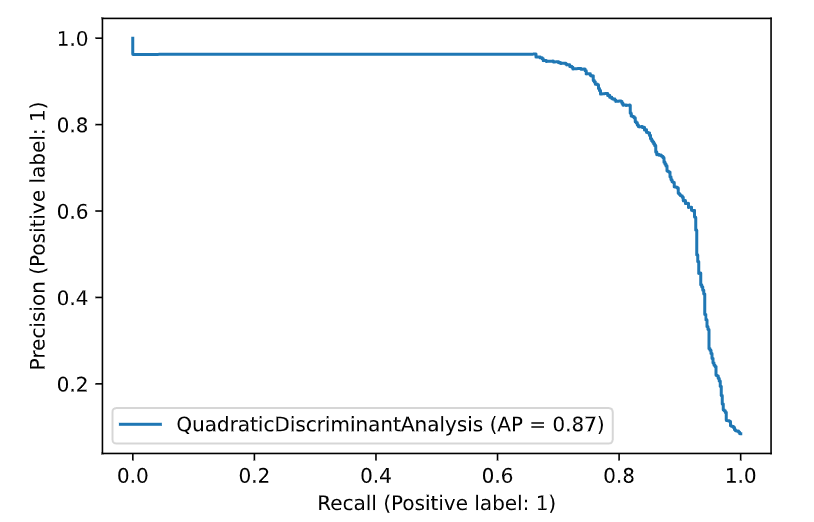
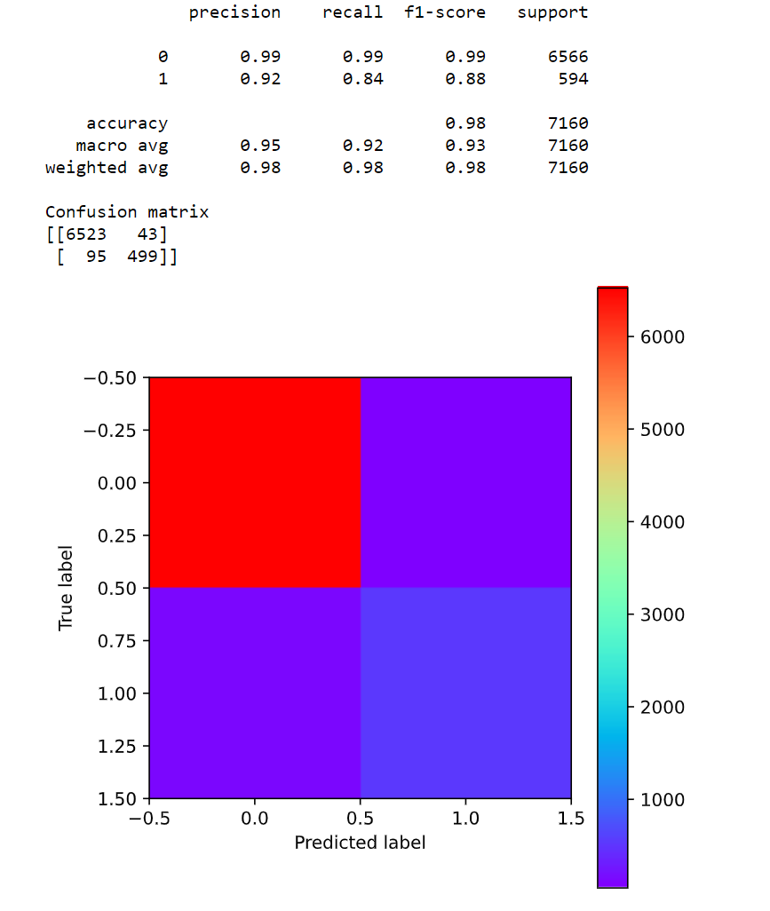
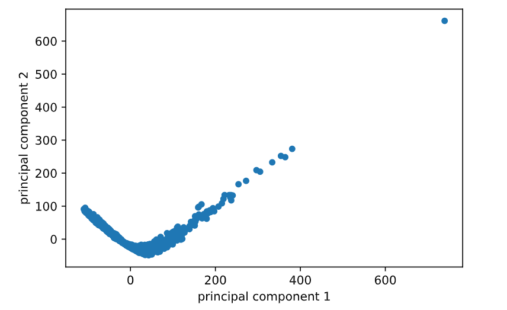
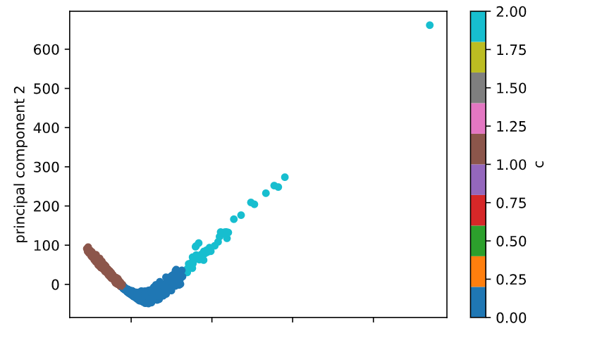
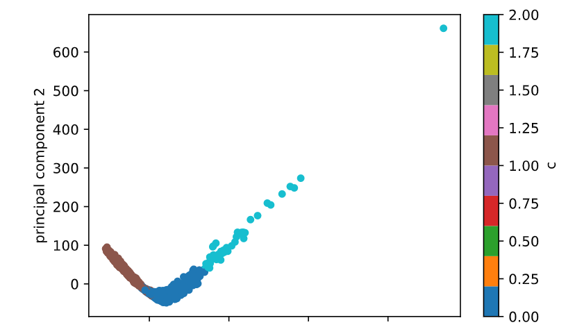

# Pulsar Star Classification

## Introduction

A pulsar is a highly magnetized rotating compact star that emits beams of electromagnetic radiation out of its magnetic poles. This radiation can be observed only when a beam of emission is pointing toward Earth (similar to the way a lighthouse can be seen only when the light is pointed in the direction of an observer).

Each pulsar produces a slightly different emission pattern, which varies slightly with each rotation. Thus a potential signal detection known as a 'candidate', is averaged over many rotations of the pulsar, as determined by the length of an observation. In the absence of additional info, each candidate could potentially describe a real pulsar. However in practice most of detections are caused by radio frequency interference (RFI) and noise, making legitimate signals hard to find.
Machine learning tools can now be used to automatically label pulsar candidates to facilitate rapid analysis. Classification systems in particular are being widely adopted, which treat the candidate data sets as binary classification problems. Here the legitimate pulsar examples are a minority positive class, and spurious examples the majority negative class. At present multi-class labels are unavailable.

## Dataset

HTRU2 is a data set which describes a sample of pulsar candidates collected during the High Time Resolution Universe Survey (South). The data set shared here contains 16,259 spurious examples caused by RFI/noise, and 1,639 real pulsar examples. These examples have all been checked by human annotators. The data is presented in two formats: CSV and ARFF (used by the WEKA data mining tool). Candidates are stored in both files in separate rows. Each row lists the variables first, and the class label is the final entry. The class labels used are 0 (negative) and 1 (positive).

### Correlation plot

### Variable Importance Plot

# Supervised Learning Methods (Classification)

## Quadratic Discriminant Analysis : Precision = 78%, Recall = 85%, Accuracy= 97%

## Random Forest Classifier: Precision = 93%, Recall = 83%, Accuracy = 98%

# Unsupervised Learning Methods (Clustering)

- Visualization of PCA-transformed data with reduced dimensionality transformation
	Principal Component Analysis was used for data representation and visualization purposes, it was not used before or during clustering, i.e. the clustering models were provided the full dimensionality of the data. 

	

## K Means Clustering on pca transformed data

The first of the unsupervised algorithms, K-means clustering, is meant to find groupings in the data. The algorithm is initialized with k random vector means µ1, µ2, ..., µk (random meaning each are assigned to a random data point in the set); it then assigns every training example to the mean that is closest to it. It then reassigns each mean to the mean of the examples that were assigned to it, and begins again by assigning every training example to the new mean that is closest. 
The algorithm finishes when no training examples are reassigned to a different mean during an iteration. K-means is implemented with k = 3. The Silhouette Coefficient for the resulting 3 clusters was 0.44. The clusters were divided into counting of [974 621 44]. These clusters are visualised on a 2-dimensional plot by projecting the data on the 2 principal components computed by PCA

## Agglomerative Clustering

Agglomerative Clustering is implemented using scikit-learn, and is applied for 3 clusters. The Silhouette Coefficient for the resulting 3 clusters was 0.41. The clusters were divided into counting of [878 718 43]. These clusters are visualised on a 2- dimensional plot by projecting the data on the 2 principal components computed by PCA

